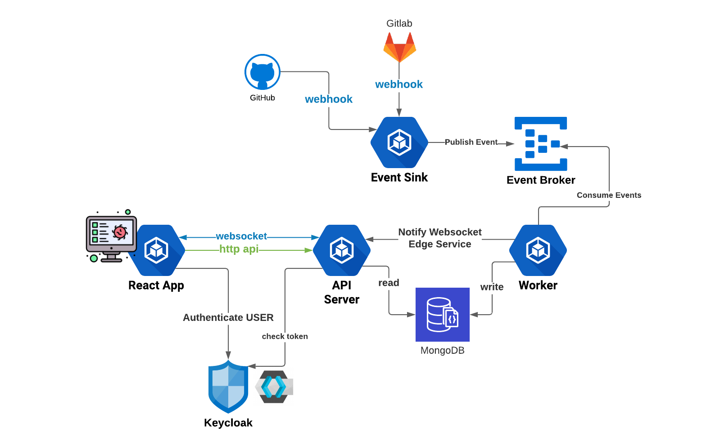

# Pulse

A dashboard app for centralized CI status monitoring, Across projects, repos and platforms (Gitlab, Github, etc...). 
The plan is to also cover live application health status.

---


---

## Architecture



---

## Development

### Run E2E Docker Compose

```bash
docker stack down pulse-tools
docker stack deploy --compose-file docker-compose.tools.yaml pulse-tools
```
### React app
#### Add in windows local env
```sh
yarn global add win-node-env
```
#### Docker

```sh
$ docker build -t pulse:v1 .
$ docker run -p 80:80 -e "API_URL=https://changed-api-url.com" -e "NODE_ENV=production" pulse:v1
```