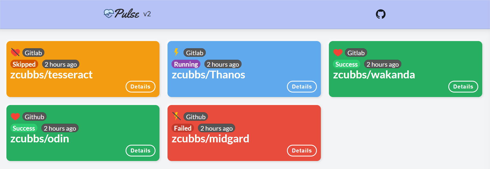

# Pulse

A dashboard app for centralized CI status monitoring, Across projects, repos and platforms (Gitlab, Github, etc...). 
The plan is to also cover live application health status.

---


---

---

## Feature Roadmap

- [x] GitlabCI Support
- [ ] Github Actions Support
- [ ] Jenkins Pipelines Support
- [x] Migrate to Postgres
- [ ] Multi Branch status display
- [x] Move to gRPC API
- [ ] OIDC Support
- [ ] Add support for mTLS

---

## Architecture


---

## Development

### Protoc Setup 
## Setup

1. Install the latest release of Protocol Buffers from [here](https://github.com/protocolbuffers/protobuf/releases/latest).
2. Install the Go protocol buffers plugin running `go get -u github.com/golang/protobuf/protoc-gen-go`.
3. Install the *protoc-gen-grpc-web* protoc plugin from [here](https://github.com/grpc/grpc-web/releases).
   Rename exe file to 'protoc-gen-grpc-web.exe'
   Relocate this protoc-gen-grpc-web.exe file to bin directory of protoc
   Example: C:\proto3\bin

### Run E2E Docker Compose

```bash
docker stack down pulse-tools
docker stack deploy --compose-file docker-compose.tools.yaml pulse-tools
```
### Go Fiber API Server
#### Install ngrok and open a channel
```bash
choco install ngrok
ngrok http 8000 
```
### Go gRPC Server
#### Test gRPC Methods
```bash
grpcurl --plaintext -d '{\"group\": \"test\"}' localhost:9092 pipelines.PipelineStatus.GetStatus
```
### React app
#### Add in windows local env
```sh
yarn global add win-node-env
yarn global add @grpc/proto-loader
```
#### Docker

```sh
$ docker build -t pulse:v1 .
$ docker run -p 80:80 -e "API_URL=https://changed-api-url.com" -e "NODE_ENV=production" pulse:v1
```
